# Multi-Platform ChatGPT Line Bot

[中文](README.md) | English

[](https://www.python.org/downloads/)
[](https://flask.palletsprojects.com/)
[](tests/)
[](tests/)
[](LICENSE)
[](https://cloud.google.com/run)
[](https://developers.line.biz/)
[](https://openai.com/)
[](https://anthropic.com/)
[](https://ai.google.dev/)
[](https://ollama.ai/)
[](#architecture)
[](README.md)

This project is a **multi-platform chatbot** supporting LINE, Discord, Telegram and other platforms, integrated with multiple AI model providers (OpenAI, Anthropic Claude, Google Gemini, Ollama). The bot features modular architecture design, deployed on Google Cloud Run with Google Cloud SQL for conversation history management, and supports both text and audio message processing.

**🆕 v2.1 Core Infrastructure Integration Upgrade**: High-performance logging system and security module integration, optimizing performance and simplifying maintenance.
**🎯 Testing Validation Complete**: 73+ unit tests fully passed, comprehensive core module coverage.

## 🚀 Quick Start

### ⚡ 3-Step Quick Deployment

<details>
<summary><strong>📋 Prerequisites Checklist (Click to expand)</strong></summary>

**Required Items**:
- OpenAI API Key: [Register OpenAI](https://platform.openai.com/)
- LINE Bot: [Create LINE Channel](https://developers.line.biz/console/)
- Google Cloud Account: [Enable Cloud Run](https://cloud.google.com/run)

</details>

```bash
# 1️⃣ Download and Setup
git clone https://github.com/tnsprout/ChatGPT-Line-Bot.git
cd ChatGPT-Line-Bot
pip install -r requirements.txt

# 2️⃣ Quick Configuration
cp config/config.yml.example config/config.yml
# Edit config.yml with your API keys

# 3️⃣ One-Click Deploy
./scripts/deploy/deploy-to-cloudrun.sh
```

🎉 **Done!** Your multi-platform chatbot is ready

## Core Features

🤖 **Multi-AI Model Support**: Unified interface integrating OpenAI, Anthropic, Gemini, Ollama  
🌐 **Multi-Platform Support**: Unified management of LINE, Discord, Telegram platforms  
📚 **RAG Knowledge Base**: All models support document retrieval and citation features  
🔗 **Unified Citation Processing**: Consistent citation formatting across models  
🎯 **Platform Abstraction**: Factory Pattern supports rapid expansion of new platforms  
🛡️ **Enterprise-Grade Security**: Input validation, rate limiting, error handling  
📊 **Monitoring & Logging**: Complete system monitoring and performance metrics  
🧠 **Smart Resource Management**: Memory monitoring, smart garbage collection, optimized polling strategies  
⚡ **Performance Optimization**: Pre-compiled regex patterns, async processing, caching mechanisms

## Table of Contents

- [Prerequisites](#prerequisites)
- [AI Model Setup](#ai-model-setup)
  - [OpenAI Assistant API](#setting-up-openai-assistant-api)
  - [Anthropic Claude](#setting-up-anthropic-claude)
  - [Google Gemini](#setting-up-google-gemini)
  - [Ollama Local Models](#setting-up-ollama-local-models)
- [Platform Setup](#platform-setup)
  - [LINE Bot](#configuring-the-line-bot)
  - [Discord Bot](#setting-up-discord-bot)
  - [Telegram Bot](#setting-up-telegram-bot)
- [System Configuration](#system-configuration)
  - [Database Setup](#configuring-google-cloud-sql)
  - [Multi-Platform Configuration](#configuration-management)
- [Deployment](#deployment)
  - [Local Development](#local-development-setup)
  - [Google Cloud Run](#deploying-to-google-cloud-run)
- [Development & Testing](#development--testing)
- [FAQ & Troubleshooting](#faq--troubleshooting)
  - [Frequently Asked Questions](#frequently-asked-questions)
  - [Troubleshooting Steps](#troubleshooting-steps)
  - [Deployment Checklist](#deployment-checklist)
  - [Performance Optimization](#performance-optimization)
- [Monitoring & Maintenance](#monitoring--maintenance)

## Prerequisites

### Basic Requirements
- Python 3.8+ development environment
- Google Cloud Platform account (for deployment and database)

### AI Model Providers (choose at least one)
- **OpenAI**: API key and Assistant setup
- **Anthropic Claude**: API key
- **Google Gemini**: API key
- **Ollama**: Local model runtime environment

### Chat Platforms (choose at least one)
- **LINE**: LINE Developers account
- **Discord**: Discord Developer Portal account
- **Telegram**: Telegram BotFather setup

## AI Model Setup

### Obtaining OpenAI API Token

1. Register/Login at [OpenAI Platform](https://platform.openai.com/)
2. Create a new Project from the avatar menu in the upper left corner.
3. Once inside the Project, navigate to Project → API Key.
4. Click `+ Create` in the upper right corner to generate an OpenAI API Token.

### Setting Up Anthropic Claude

1. **Get Claude API Key**
   - Go to [Anthropic Console](https://console.anthropic.com/)
   - Register and log in to your account
   - Create a new API Key in the API Keys page

2. **Choose Model**
   - Recommended to use `claude-3-sonnet-20240229` or `claude-3-haiku-20240307`
   - Choose models that balance performance and cost based on your needs

### Setting Up Google Gemini

1. **Get Gemini API Key**
   - Go to [Google AI Studio](https://aistudio.google.com/)
   - Log in with your Google account
   - Create a new API Key in the API Keys page

2. **Choose Model**
   - Recommended to use `gemini-1.5-pro-latest` or `gemini-1.5-flash-latest`
   - Gemini supports long context and multimodal functionality

### Setting Up Ollama Local Models

1. **Install Ollama**
   ```bash
   # macOS
   brew install ollama
   
   # Linux
   curl -fsSL https://ollama.ai/install.sh | sh
   
   # Windows - Download installer
   # https://ollama.ai/download
   ```

2. **Download Models**
   ```bash
   # Download Llama 3.1 8B model (recommended)
   ollama pull llama3.1:8b
   
   # Or download other models
   ollama pull mistral:7b
   ollama pull codellama:13b
   ```

3. **Start Service**
   ```bash
   ollama serve
   # Default runs on http://localhost:11434
   ```

## Setting Up OpenAI Assistant API

1. **Create an Assistant**
   - Within the project, go to "Playground" at the top, then select "Assistants" on the left to enter the OpenAI Assistant API interface. Create a new Assistant.

2. **Upload Required Files for Database**
   - In the Assistant interface, configure the name and System instructions as the bot's default system prompt. It's recommended to select `gpt-4o` as the model and set Temperature to `0.01`.
   - Go to Tools → File Search, click `+ Files` to upload files you want as the database.

3. **Testing in Playground**
   - Go to [OpenAI Playground](https://platform.openai.com/playground) and test the Assistant's functionality.

4. **Record assistant_id**
   - Under the Assistant name, there's a text string representing the `assistant_id`. Note it down for later use.

## Platform Setup

### Configuring the Line Bot

1. **Create a Line Bot**
   - Log into the [Line Developers Console](https://developers.line.biz/console/)
   - Create a new Provider and Channel (Messaging API).

2. **Get Channel Information**
   - In the Channel settings, obtain the `Channel Access Token` and `Channel Secret`.
   - Under `Basic Settings`, there's a `Channel Secret`. Click `Issue` to generate your `channel_secret`.
   - Under `Messaging API`, there's a `Channel Access Token`. Click `Issue` to generate your `channel_access_token`.

3. **Set Webhook URL**
   - Set the Webhook URL to the Google Cloud Run deployment address (can be updated after deployment)
   - Enable Webhook by toggling the "Use Webhook" switch to on

### Setting Up Discord Bot

1. **Create Discord Application**
   - Go to [Discord Developer Portal](https://discord.com/developers/applications)
   - Click "New Application" to create a new application
   - Name your application

2. **Create Bot**
   - Select "Bot" from the left menu
   - Click "Add Bot" to create a bot
   - Copy the Bot Token (keep it secret)

3. **Set Permissions**
   - In "OAuth2" → "URL Generator", select appropriate permissions
   - Generate invite link and add the bot to your server

### Setting Up Telegram Bot

1. **Chat with BotFather**
   - Search for @BotFather in Telegram
   - Send `/newbot` command to create a new bot
   - Follow instructions to set bot name and username

2. **Get Bot Token**
   - BotFather will provide a Bot Token
   - Save this token for configuration

3. **Set Webhook**
   - After deployment, use the following API to set webhook:
   ```bash
   curl -X POST "https://api.telegram.org/bot<YOUR_BOT_TOKEN>/setWebhook" \
        -H "Content-Type: application/json" \
        -d '{"url": "https://your-app.run.app/webhooks/telegram"}'
   ```

## Configuring Google Cloud SQL

1. **Create Cloud SQL Instance**
   - Go to [Cloud SQL Instances](https://console.cloud.google.com/sql/instances).
   - Click **Create Instance** and choose the required database (e.g., PostgreSQL).

2. **Instance Configuration**
   - Set up the instance name and password.
   - Create an account for connection operations, noting down the username and password.
   - Create the database
   - Use Alembic to create database schema:
    ```bash
    # One-click complete database structure setup
    python scripts/setup_database.py setup
    
    # Or manually use Alembic (advanced users)
    alembic upgrade head
    ```

3. **Get Connection Information**
   - After creating the instance, record the following details:
     - Instance Connection Name
     - Host
     - Port
     - Database Name
     - Username
     - Password

4. **Obtain SSL Certificates**
   - Go to the instance details page.
   - Under the **Connections** tab, enable SSL connections.
   - Download the following certificates:
     - Server CA Certificate
     - Client Certificate
     - Client Key
   - Convert these certificates and keys using the following commands:

    ```bash
    openssl x509 -in client-cert.pem -out ssl-cert.crt # Server CA Certificate
    openssl x509 -in server-ca.pem -out ca-cert.crt # Client Certificate
    openssl rsa -in client-key.pem -out ssl-key.key # Client Key
    ```
   - Copy `ssl-cert.crt`, `ca-cert.crt`, and `ssl-key.key` to `config/ssl/`.

## Configuration Management

This project supports flexible configuration management to adapt to different deployment environment needs.

### 🎯 Configuration Priority

**Application Configuration Priority** (higher priority overrides lower priority):
1. `config/config.yml` - Basic configuration file
2. **Environment Variables** - Highest priority (suitable for production)

**Deployment Script Configuration Priority**:
1. `config/deploy/.env` - Deployment configuration file
2. **Environment Variables** - Highest priority
3. Interactive Input - Prompts when configuration is missing

### 📁 Configuration File Locations

```
config/
├── config.yml.example          # Application configuration template
├── config.yml                  # Application configuration (create manually)
└── deploy/
    ├── .env.example            # Deployment configuration template
    ├── .env                    # Deployment configuration (create manually)
    ├── Dockerfile.cloudrun     # Cloud Run Dockerfile
    └── cloudrun-service.yaml   # Cloud Run service configuration
```

### 💻 Local Development Configuration

Prepare the following information:
- `channel_access_token` - Line Channel Access Token
- `channel_secret` - Line Channel Secret
- `openai_api_key` - OpenAI API Key
- `assistant_id` - OpenAI Assistant ID
- Database connection information

**Method 1: Using Configuration File (Recommended)**

```bash
# Copy configuration template
cp config/config.yml.example config/config.yml

# Edit configuration file
vim config/config.yml
```

```yaml
# Application information
app:
  name: "Multi-Platform Chat Bot"
  version: "2.1.0"

# AI model settings (choose one as primary provider)
llm:
  provider: "openai"  # openai, anthropic, gemini, ollama

# AI model provider settings
openai:
  api_key: YOUR_OPENAI_API_KEY
  assistant_id: YOUR_ASSISTANT_ID

anthropic:
  api_key: YOUR_ANTHROPIC_API_KEY
  model: "claude-3-sonnet-20240229"

gemini:
  api_key: YOUR_GEMINI_API_KEY
  model: "gemini-1.5-pro-latest"

ollama:
  base_url: "http://localhost:11434"
  model: "llama3.1:8b"

# Database settings
db:
  host: YOUR_DB_HOST
  port: 5432
  database: YOUR_DB_NAME
  username: YOUR_DB_USER
  password: YOUR_DB_PASSWORD
  sslmode: verify-ca
  sslrootcert: config/ssl/ca-cert.crt
  sslcert: config/ssl/client.crt
  sslkey: config/ssl/client.key

# Platform settings
platforms:
  line:
    enabled: true
    channel_access_token: YOUR_LINE_CHANNEL_ACCESS_TOKEN
    channel_secret: YOUR_LINE_CHANNEL_SECRET
  
  discord:
    enabled: false  # Set to true to enable
    bot_token: YOUR_DISCORD_BOT_TOKEN
  
  telegram:
    enabled: false  # Set to true to enable
    bot_token: YOUR_TELEGRAM_BOT_TOKEN

# Text processing settings
text_processing:
  preprocessors: []
  post_replacements: []

# Command settings
commands:
  help: "Provide system instructions and available commands"
  reset: "Reset conversation history"
```

**Method 2: Using Environment Variables**

```bash
# Basic settings
export LLM_PROVIDER="openai"  # or anthropic, gemini, ollama

# AI model API keys (set according to chosen provider)
export OPENAI_API_KEY="sk-proj-xxxxxxxx"
export OPENAI_ASSISTANT_ID="asst_xxxxxxxx"
export ANTHROPIC_API_KEY="sk-ant-xxxxxxxx"
export GEMINI_API_KEY="AIza-xxxxxxxx"

# Platform settings (enable required platforms)
export LINE_CHANNEL_ACCESS_TOKEN="your_line_token"
export LINE_CHANNEL_SECRET="your_line_secret"
export DISCORD_BOT_TOKEN="your_discord_token"      # Optional: Enable Discord platform
export TELEGRAM_BOT_TOKEN="your_telegram_token"    # Optional: Enable Telegram platform

# Database settings
export DB_HOST="your_db_host"
export DB_USER="your_db_user"
export DB_PASSWORD="your_db_password"
export DB_NAME="your_db_name"

# Run application (using unified entry point)
python main.py
```

### ☁️ Production Environment Configuration

Production environment uses Google Secret Manager to manage sensitive information, injected into containers through environment variables.

**Supported Environment Variable Mapping**:

| Configuration Item | config.yml Path | Environment Variable |
|--------------------|-----------------|---------------------|
| Line Access Token | `platforms.line.channel_access_token` | `LINE_CHANNEL_ACCESS_TOKEN` |
| Line Secret | `platforms.line.channel_secret` | `LINE_CHANNEL_SECRET` |
| OpenAI API Key | `openai.api_key` | `OPENAI_API_KEY` |
| OpenAI Assistant ID | `openai.assistant_id` | `OPENAI_ASSISTANT_ID` |
| Database Host | `db.host` | `DB_HOST` |
| Database User | `db.user` | `DB_USER` |
| Database Password | `db.password` | `DB_PASSWORD` |
| Database Name | `db.db_name` | `DB_NAME` |
| Auth Method | `auth.method` | `TEST_AUTH_METHOD` |
| Log Level | `log_level` | `LOG_LEVEL` |

### 🚀 **Unified Startup Method (v2.0)**

The new version provides a unified entry point that automatically switches run modes based on the environment:

#### Development Environment
```bash
# Auto-detects as development environment, uses Flask development server
python main.py

# Or explicitly specify development environment
FLASK_ENV=development python main.py
```

#### Production Environment
```bash
# Auto-starts Gunicorn production server
FLASK_ENV=production python main.py

# Or use traditional method
gunicorn -c gunicorn.conf.py main:application
```

#### Backward Compatibility
```bash
# Legacy compatible deployment method (integrated into main.py)
gunicorn -c gunicorn.conf.py main:application
```

### 🔍 Configuration Validation

```bash
# Check application configuration
python src/core/config.py

# Check health status
curl http://localhost:8080/health

# Check deployment configuration
./scripts/deploy/deploy-to-cloudrun.sh --dry-run
```

For detailed configuration instructions, please refer to:
- [Configuration Management Guide](docs/CONFIGURATION.md)
- [Deployment Guide](DEPLOYMENT_GUIDE.md)

## Deploying to Google Cloud Run

### 🚀 Quick Deployment (Recommended)

Use our automated deployment scripts:

```bash
# 1. Set up deployment configuration
cp config/deploy/.env.example config/deploy/.env
# Edit config/deploy/.env file with your project settings

# 2. Run automated deployment script
./scripts/deploy/deploy-to-cloudrun.sh

# 3. Check configuration (optional)
./scripts/deploy/deploy-to-cloudrun.sh --dry-run
```

### 📖 Comprehensive Deployment Guide

For complete deployment process, monitoring setup, load balancer configuration, etc., please refer to:
- [Complete Deployment Guide](docs/DEPLOYMENT.md)
- [Configuration Management Guide](docs/CONFIGURATION.md)
- [Running Guide](docs/RUNNING.md)

### 🔧 Manual Deployment (Advanced Users)

If you want to manually control each step:

1. **Configure Google Cloud Console**

   ```bash
   gcloud auth login
   gcloud config set project {your-project-id}
   ```

2. **Build Container Image**

   ```bash
   gcloud builds submit --tag gcr.io/{your-project-id}/{your-image-name} -f config/deploy/Dockerfile.cloudrun .
   ```

3. **Deploy to Cloud Run**

   ```bash
   gcloud run services replace config/deploy/cloudrun-service.yaml --region {your-region}
   ```

   - Replace placeholders with your actual information.

4. **Test Deployment Results**

   - After deployment, a Service URL will be returned, e.g., `https://chatgpt-line-bot-****.run.app`. Note this down.

5. **Set Webhook URL**

   - In the Line Bot settings, set the Webhook URL to the Service URL.
   - Enable Webhook by toggling the "Use Webhook" switch on.
   - Click Verify to check the connection.

## Testing the Application

### 🔐 Web Test Interface (v2.0)

1. **Access Login Page**
   - Go to `https://{your-cloud-run-url}/login`
   - Enter the test password set in `config.yml`
   - After successful login, you'll be automatically redirected to the chat interface

2. **Use Chat Interface**
   - After login, visit `https://{your-cloud-run-url}/chat`
   - Test bot functionality directly in the chat interface
   - Supports text messages and complete conversation history
   - Click "Logout" button to safely logout

3. **API Endpoint Testing**
   ```bash
   # Health check
   curl https://{your-cloud-run-url}/health
   
   # Application information
   curl https://{your-cloud-run-url}/
   ```

### 📱 Testing via LINE

4. **LINE Bot Functionality Test**
   - Send messages to your LINE Bot to test complete functionality
   - Supports text and voice messages
   - Test conversation history and multi-turn conversations

### 🔍 Troubleshooting

5. **Check System Logs**
   - If issues arise, use `gcloud` or Google Cloud Console to check logs
   ```bash
   # View real-time logs
   gcloud logs tail --project={your-project-id}
   ```

### ⚙️ Test Password Configuration

**Production Environment**:
```bash
# Set environment variable (recommended)
export TEST_PASSWORD="your_secure_password_here"
```

**Development Environment**:
```yaml
# Set in config/config.yml
auth:
  method: "simple_password"
  password: "your_test_password"
```

## Development & Testing

### Local Development Setup

1. **Install Dependencies**
   ```bash
   pip install -r requirements.txt
   ```

2. **Configure Local Environment Variables**
   ```bash
   # Copy environment template
   cp .env.local.example .env.local
   
   # Edit .env.local with your configurations
   vim .env.local
   ```

3. **Run Development Server**
   
   **🔧 Development Environment (Recommended):**
   ```bash
   # Start using development script
   ./scripts/dev.sh
   ```
   
   **🧪 Local Production Testing:**
   ```bash
   # Test production configuration locally
   ./scripts/test-prod.sh
   ```
   
   **⚡ Direct Execution:**
   ```bash
   # Development mode (warnings are normal)
   python main.py
   
   # Production mode (auto-starts Gunicorn)
   FLASK_ENV=production python main.py
   ```

## System Architecture

### 🎯 **Core Module Integration (v2.1)**

Core infrastructure has been integrated and upgraded for improved performance and maintainability:

#### Integration Module Description
- **src/core/logger.py**: Integrated high-performance logging system (removed optimized_logger.py)
  - Pre-compiled regex patterns for sensitive data filtering
  - Asynchronous log processing to avoid I/O blocking
  - Structured log format with colored console output
  - Performance monitoring and statistics

- **src/core/security.py**: Integrated security module (removed optimized_security.py)
  - O(1) complexity rate limiter
  - Pre-compiled regex patterns for input validation
  - Security configuration management and middleware
  - Caching mechanisms for improved cleaning performance

#### Architecture Optimization Results
- ✅ **Reduced File Count**: Removed duplicate optimized_* files
- ✅ **Performance Improvement**: Pre-compiled regex patterns, async processing, caching mechanisms
- ✅ **Simplified Maintenance**: Unified module interfaces, reduced complexity
- ✅ **Backward Compatibility**: Existing API interfaces remain unchanged

### 📐 System Architecture Diagram

```mermaid
graph TB
    subgraph "🌐 Platform Layer"
        LINE[📱 LINE Bot]
        DISCORD[🎮 Discord Bot]
        TELEGRAM[📡 Telegram Bot]
        WEB[🌍 Web Chat]
    end
    
    subgraph "🧠 AI Model Layer"
        OPENAI[🤖 OpenAI<br/>GPT-4]
        ANTHROPIC[🎯 Anthropic<br/>Claude]
        GEMINI[💎 Google<br/>Gemini]
        OLLAMA[🏠 Ollama<br/>Local]
    end
    
    subgraph "⚙️ Service Layer"
        CHAT[💬 chat.py<br/>Text Chat]
        AUDIO[🎤 audio.py<br/>Audio Transcription]
        CONV[📝 conversation.py<br/>Conversation Management]
        RESP[📤 response.py<br/>Response Formatting]
    end
    
    subgraph "🗄️ Data Layer"
        DB[(🐘 PostgreSQL<br/>Database)]
        THREAD[🧵 Thread<br/>Management]
        HISTORY[📚 Conversation<br/>History]
    end
    
    subgraph "🔧 Core Infrastructure"
        LOGGER[📋 logger.py<br/>Logging System]
        SECURITY[🛡️ security.py<br/>Security Module]
        MEMORY[🧠 memory_monitor.py<br/>Memory Monitoring]
        POLLING[⏰ smart_polling.py<br/>Smart Polling]
    end
    
    LINE --> CHAT
    DISCORD --> CHAT
    TELEGRAM --> CHAT
    WEB --> CHAT
    
    CHAT --> OPENAI
    CHAT --> ANTHROPIC
    CHAT --> GEMINI
    CHAT --> OLLAMA
    
    AUDIO --> CHAT
    CHAT --> CONV
    CONV --> DB
    CHAT --> RESP
    
    OPENAI --> THREAD
    ANTHROPIC --> HISTORY
    GEMINI --> HISTORY
    OLLAMA --> HISTORY
    
    CHAT -.-> LOGGER
    CHAT -.-> SECURITY
    CHAT -.-> MEMORY
    OPENAI -.-> POLLING
    
    style LINE fill:#00C300
    style OPENAI fill:#412991
    style ANTHROPIC fill:#FF8C42
    style GEMINI fill:#4285F4
    style OLLAMA fill:#8B5CF6
```



### File Structure

```
src/
├── services/           # Service Layer
│   ├── chat.py        # Core text chat service
│   ├── audio.py       # Audio transcription service
│   ├── conversation.py # Conversation management
│   └── response.py    # Response formatting
├── database/          # Database Layer
│   ├── connection.py  # Database connection
│   ├── models.py      # Data models
│   ├── operations.py  # Database operations
│   └── init_db.py     # Database initialization
├── core/              # Core Infrastructure (v2.1 Integrated)
│   ├── config.py      # Configuration manager
│   ├── logger.py      # Integrated high-performance logging system
│   ├── security.py    # Integrated security module
│   ├── error_handler.py # Error handling
│   ├── auth.py        # Authentication system
│   └── memory.py      # Memory management
├── platforms/         # Platform Support
│   ├── base.py        # Platform abstraction interface
│   ├── factory.py     # Platform factory
│   └── line_handler.py # LINE platform handler
├── models/           # AI Model Integration
│   ├── base.py       # Model abstraction interface
│   ├── factory.py    # Model factory
│   ├── openai_model.py # OpenAI integration
│   ├── anthropic_model.py # Anthropic integration
│   ├── gemini_model.py # Gemini integration
│   └── ollama_model.py # Ollama integration
├── templates/         # Web templates
│   ├── chat.html
│   └── login.html
└── utils/            # Utility modules
    ├── main.py       # Text processing utilities
    └── retry.py      # Retry mechanisms

scripts/
└── setup_database.py # One-click database setup

alembic/               # Database migration management
├── versions/
│   ├── 000_initial_schema.py      # Complete initial structure
│   └── 001_add_platform_support.py # Multi-platform support
└── alembic.ini        # Alembic configuration
```

### Unified Citation Processing

All AI models' document citations are unified through `ResponseFormatter`:

**Message Processing Flow**:

**Text Message Flow**:
1. **Platform Input** → ChatService → AI Model → ResponseFormatter → **Platform Output**

**Audio Message Flow**:
1. **Platform Input** → AudioService (Transcription) → app.py (Orchestration) → ChatService → AI Model → ResponseFormatter → **Platform Output**

**Citation Processing Flow**:
1. **AI Model Response** → Contains RAGResponse (answer + sources)
2. **ResponseFormatter** → Unifies source formatting to readable citations
3. **Final Response** → Consistent citation format `[1]: Document Name`

**Supported Citation Formats**:
- **OpenAI**: Assistant API file citations `[i]` → `[i]: filename`
- **Anthropic**: Claude Files API references `[filename]` → `[i]: filename`  
- **Gemini**: Semantic Retrieval results → `[i]: filename (Relevance: 95%)`
- **Ollama**: Vector search results → `[i]: filename (Similarity: 0.89)`

### Design Patterns

- **Factory Pattern**: Dynamic creation of AI models and platforms
- **Strategy Pattern**: Unified interface for different AI models
- **Registry Pattern**: Registration management for platforms and models
- **Adapter Pattern**: Adaptation of platform-specific features

### Database Architecture

The system uses PostgreSQL database with multi-platform conversation management. The database structure includes:

- **User Thread Management**: Supports OpenAI Assistant API multi-platform thread management
- **Conversation History**: Stores conversation records for non-OpenAI models
- **Multi-Platform Support**: All tables support LINE, Discord, Telegram, and other platforms

### Database Initialization and Migrations

This project uses Alembic to manage database migrations. This allows you to version control your database schema and easily upgrade it as your models change.

**1. Initializing the Database**

For the first time, you can set up the complete database schema with a single command:

```bash
# One-click setup for the initial schema
python scripts/setup_database.py setup
```

**2. Creating a New Migration**

When you change your SQLAlchemy models in `src/database/models.py` (e.g., add a new table or a new column), you need to create a new migration script.

```bash
# Automatically detect model changes and generate a new migration script
alembic revision --autogenerate -m "Describe your changes here"
```

This will create a new file in `alembic/versions/`.

**3. Applying Migrations**

To apply the latest migrations to your database, run:

```bash
# Upgrade the database to the latest version
alembic upgrade head
```

**4. Checking Database Status**

You can check the current status of your database migrations with:

```bash
# Show the current migration version
alembic current

# Check for any unapplied migrations
alembic check
```

</details>

### Install Test Dependencies

```bash
pip install -r requirements-test.txt
```

### Running Tests

This project uses pytest as the testing framework, including unit tests, integration tests, and API tests.

**Run all tests:**
```bash
pytest
```

**Run specific test types:**
```bash
# Unit tests
pytest tests/unit/

# Integration tests
pytest tests/integration/

# API tests
pytest tests/api/

# External service mock tests
pytest tests/mocks/
```

**Test coverage report:**
```bash
pytest --cov=src --cov-report=html
```

**Detailed test output:**
```bash
pytest -v
```

**Specify test file:**
```bash
pytest tests/unit/test_models.py
pytest tests/integration/test_chat_flow.py
```

### Code Quality Checks

```bash
# Check code style
flake8 src/ tests/

# Type checking
mypy src/
```

### Test Troubleshooting

If you encounter import errors or cache issues:
```bash
# Clean Python cache files
find . -name "*.pyc" -delete
find . -name "__pycache__" -type d -exec rm -rf {} + 2>/dev/null || true
rm -rf .pytest_cache

# Re-run tests
pytest
```

**CI/CD Integration Testing:**
```bash
# Run complete CI/CD simulation test flow
./scripts/ci-test.sh
```

### Test Architecture (Updated 2025)

This project adopts a layered testing architecture covering all critical functionalities:

- **Unit Tests** (`tests/unit/`): Test individual modules and core functionalities
  - AI Model Tests (OpenAI, Anthropic, Gemini, Ollama)
  - Platform Handler Tests (LINE, Discord, Telegram)
  - Core Service Tests (Chat, Conversation Management, Response Formatting)
  - Database-related Tests (ORM, Connection, Operations)
  - Authentication and Configuration Management Tests
  - **Core Infrastructure Tests**: Memory monitoring, security modules, smart polling, etc.
- **Integration Tests** (`tests/integration/`): Test cross-module end-to-end functionality
  - Database and ORM Integration Tests
  - Multi-platform Workflow Tests
- **API Tests** (`tests/api/`): Test Flask endpoints and Web interfaces
  - Health Check and System Status Endpoints
  - Multi-platform Webhook Endpoint Tests
- **Mock Tests** (`tests/mocks/`): Test external service mocks and integrations
  - AI Model API Mocks (OpenAI, Anthropic, Gemini, Ollama)
  - Platform API Mocks (LINE Bot, Discord, Telegram)
  - Database Operation Mocks
- **Main Application Tests** (`test_main.py`): Test application entry points and WSGI compatibility

#### Test Quality Assurance Features
- ✅ **Architectural Consistency**: Tests reflect actual system architecture and responsibility separation
- ✅ **Platform Awareness**: Complete test coverage for multi-platform unified interfaces
- ✅ **Citation Processing**: Proper testing of AI model citation architecture separation
- ✅ **Error Handling**: Dual-layer error messages and exception handling tests
- ✅ **Configuration Management**: Environment variable override and configuration compatibility tests
- ✅ **Robustness Enhancement**: Resolved module reloading and time simulation test stability issues

#### Key Module Test Coverage
- **security.py**: O(1) rate limiter, pre-compiled regex validation
- **smart_polling.py**: Smart polling strategy and context management
- **memory_monitor.py**: Memory monitoring and garbage collection
- **app.py**: Core application functionality testing

#### Latest Testing Improvements (2025)
- ✅ **Fixed Module Reload Issues**: Resolved `importlib.reload()` causing `isinstance` check failures
- ✅ **Enhanced Time Mocking**: Improved time simulation mechanisms, avoiding `StopIteration` exceptions
- ✅ **Rate Limiter Testing**: Bypassed global mock interference, ensuring real RateLimiter statistics testing
- ✅ **Test Isolation**: Separated test errors, ensuring tests don't interfere with each other
- ✅ **Comprehensive Coverage**: Added 73+ unit tests, continuously improving coverage

### Configuration Files

Test configuration files are located in `pytest.ini`, including the following settings:
- Test paths
- Coverage settings
- Test markers
- Output format

## FAQ & Troubleshooting

### 🔧 Frequently Asked Questions

#### Q1: LINE Bot not responding after deployment?
**Solutions**:
```bash
# 1. Check Webhook URL configuration
curl -X POST https://your-app.run.app/webhooks/line

# 2. Check environment variables
gcloud run services describe YOUR_SERVICE --region=YOUR_REGION

# 3. View real-time logs
gcloud logs tail --project=YOUR_PROJECT_ID
```

#### Q2: Database connection failed?
**Checklist**:
- ✅ SSL certificate files correctly placed in `config/ssl/`
- ✅ Database username and password are correct
- ✅ Firewall rules allow connections
- ✅ Environment variables DB_HOST, DB_USER, DB_PASSWORD are set

#### Q3: AI model response errors?
**Diagnostic steps**:
```bash
# Check if API key is valid
curl -H "Authorization: Bearer $OPENAI_API_KEY" https://api.openai.com/v1/models

# Check configuration file
python -c "from src.core.config import ConfigManager; print(ConfigManager().get_config())"
```

#### Q4: High memory usage?
**Monitoring & optimization**:
```bash
# Check memory usage
curl https://your-app.run.app/health

# Manually trigger garbage collection (development only)
curl -X POST https://your-app.run.app/debug/gc
```


#### Q5: Core module performance issues?
**Performance optimization checks**:
```bash
# Check rate limiter statistics
curl https://your-app.run.app/debug/security

# Check memory monitoring status
curl https://your-app.run.app/debug/memory

# Check logging performance statistics
curl https://your-app.run.app/debug/logs
```

### 🚨 Troubleshooting Steps

#### 1. Quick Diagnosis
```bash
# Check overall system health
curl https://your-app.run.app/health

# Check application information
curl https://your-app.run.app/

# Check platform status
curl https://your-app.run.app/metrics
```

#### 2. Log Analysis
```bash
# View latest error logs
gcloud logs read --project=YOUR_PROJECT_ID --filter="severity>=ERROR" --limit=50

# View logs for specific time range
gcloud logs read --project=YOUR_PROJECT_ID --filter="timestamp>='2025-01-01T00:00:00Z'"

# Real-time log monitoring
gcloud logs tail --project=YOUR_PROJECT_ID
```

#### 3. Configuration Validation
```bash
# Validate configuration file syntax
python -c "import yaml; yaml.safe_load(open('config/config.yml'))"

# Check environment variables
env | grep -E "(OPENAI|LINE|DB_|FLASK_)"

# Test database connection
python scripts/setup_database.py health
```

### 📋 Deployment Checklist

#### Pre-deployment Verification
- [ ] All API keys set and valid
- [ ] Database created and accessible
- [ ] SSL certificate files correctly placed
- [ ] Configuration file format is correct
- [ ] Local testing passed

#### Post-deployment Validation
- [ ] Health check endpoint returns normal: `/health`
- [ ] Webhook URL configured correctly
- [ ] LINE Bot can receive and respond to messages
- [ ] Database connection is normal
- [ ] No obvious errors in logs

### ⚡ Performance Optimization

#### 1. Memory Optimization
```yaml
# Adjust in Cloud Run configuration
resources:
  limits:
    memory: "2Gi"
    cpu: "1000m"
  requests:
    memory: "1Gi"
    cpu: "500m"
```

#### 2. Rate Limiting Adjustment
```bash
# Adjust environment variables based on usage
export GENERAL_RATE_LIMIT=120
export WEBHOOK_RATE_LIMIT=300
export MAX_MESSAGE_LENGTH=5000
```

#### 3. Database Connection Pool
```yaml
# Configure in config.yml
db:
  pool_size: 5
  pool_timeout: 30
  pool_recycle: 3600
```

### 🔒 Security Best Practices

#### Production Environment Security
- ✅ Use Google Secret Manager for sensitive information
- ✅ Regularly rotate API keys
- ✅ Enable Cloud Run authentication
- ✅ Set appropriate IAM roles and permissions

#### Development Environment Security
- ✅ Don't commit sensitive information to Git
- ✅ Use `.env.local` for development environment configuration
- ✅ Regularly check dependencies for security vulnerabilities
- ✅ Enable code scanning and security checks

## Monitoring & Maintenance

### 📊 System Monitoring

#### Built-in Monitoring Endpoints
```bash
# Application health status
curl https://your-app.run.app/health

# System metrics
curl https://your-app.run.app/metrics

# Memory monitoring
curl https://your-app.run.app/debug/memory
```

#### Google Cloud Monitoring
```bash
# Set up monitoring alerts
gcloud alpha monitoring policies create --policy-from-file=monitoring-policy.yaml

# View Cloud Run metrics
gcloud run services describe YOUR_SERVICE --region=YOUR_REGION
```

### 🔄 Regular Maintenance

#### Weekly Checks
- Check system logs for abnormal patterns
- Verify database backups are working
- Check API usage and costs
- Update dependencies (test environment first)

#### Monthly Reviews
- Review system performance metrics
- Analyze user behavior patterns
- Plan capacity expansion needs
- Check security settings

## Notes

### 🚫 Important Limitations
- **LINE Bot Message Limit**: Maximum 5000 characters per message
- **OpenAI API Limits**: Based on your subscription plan
- **Cloud Run Limits**: Maximum 60 minutes timeout per request
- **Database Connections**: Note Cloud SQL connection limits

### ⚠️ Security Considerations
- Ensure all sensitive information is stored only in `config/ssl/` and environment variables
- Regularly check Google Cloud IAM permission settings
- Use Google Secret Manager for production environment passwords
- Follow principle of least privilege for service accounts

### 💡 Development Recommendations
- Write test cases before developing new features
- Use branching strategy for version control
- Regularly run complete test suite
- Maintain consistent code formatting and documentation

## Support Us

This project is by Tainan Sprout. To support the project, please [donate to Tainan Sprout](https://bit.ly/3RBvPyZ).

## Acknowledgments

This project is forked from [ExplainThis's ChatGPT-Line-Bot](https://github.com/TheExplainthis/ChatGPT-Line-Bot). Special thanks to them.

## License

[MIT](LICENSE)