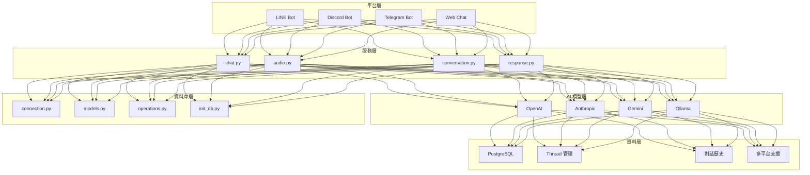

# 多平台聊天機器人 ChatGPT Line Bot

中文 | [English](README.en.md)

[](https://opensource.org/licenses/MIT)
[](https://www.python.org/downloads/)
[](https://github.com/psf/black)
[](htmlcov/index.html)
[](https://github.com/tnsprout/ChatGPT-Line-Bot/actions)

本專案是一個**多平台聊天機器人**，支援 LINE、Discord、Telegram 等多個平台，整合了多種 AI 模型提供商（OpenAI、Anthropic Claude、Google Gemini、Ollama）。機器人採用模組化架構設計，部署在 Google Cloud Run 上，並使用 Google Cloud SQL 進行對話歷史管理。

**🆕 v2.1 核心基礎設施整合升級**：高效能日誌系統與安全模組整合，優化效能並簡化維護。

## 核心特色

🤖 **多 AI 模型支援**: 統一介面整合 OpenAI、Anthropic、Gemini、Ollama  
🌐 **多平台支援**: LINE、Discord、Telegram 等平台統一管理  
📚 **RAG 知識庫**: 所有模型支援文檔檢索與引用功能  
🔗 **統一引用處理**: 跨模型的一致引用格式化  
🎯 **平台抽象化**: Factory Pattern 支援快速擴展新平台  
🛡️ **企業級安全**: 輸入驗證、速率限制、錯誤處理  
📊 **監控與日志**: 完整的系統監控和性能指標

## 目錄

- [前置準備](#前置準備)
- [AI 模型設定](#ai-模型設定)
- [平台設定](#平台設定)
- [系統配置](#系統配置)
- [部署](#部署)
- [開發與測試](#開發與測試)
- [系統架構](#系統架構)
- [貢獻指南](#貢獻指南)
- [常見問題與故障排除](#常見問題與故障排除)
- [監控與維護](#監控與維護)

## 前置準備

### 基本需求
- Python 3.8+ 開發環境
- Google Cloud Platform 帳號（用於部署和資料庫）

### AI 模型提供商（至少選擇一個）
- **OpenAI**: API 金鑰和 Assistant 設定
- **Anthropic Claude**: API 金鑰
- **Google Gemini**: API 金鑰
- **Ollama**: 本地模型運行環境

### 聊天平台（至少選擇一個）
- **LINE**: LINE Developers 帳號
- **Discord**: Discord Developer Portal 帳號
- **Telegram**: Telegram BotFather 設定

## AI 模型設定

<details>
<summary>點擊展開 AI 模型設定詳情</summary>

### 取得 OpenAI 的 API Token

1. [OpenAI Platform](https://platform.openai.com/) 平台中註冊/登入帳號
2. 左上方有一個頭像，在那邊建立一個 Project。
3. 進入 Project 後，於左邊尋找 Project → API Key
4. 點選右上角的 `+ Create` ，即可生成 OpenAI 的 API Token。

### 設定 Anthropic Claude

1. **取得 Claude API Key**
   - 前往 [Anthropic Console](https://console.anthropic.com/)
   - 註冊並登入帳號
   - 在 API Keys 頁面建立新的 API Key

2. **選擇模型**
   - 建議使用 `claude-3-sonnet-20240229` 或 `claude-3-haiku-20240307`
   - 根據需求選擇平衡效能和成本的模型

### 設定 Google Gemini

1. **取得 Gemini API Key**
   - 前往 [Google AI Studio](https://aistudio.google.com/)
   - 登入 Google 帳號
   - 在 API Keys 頁面建立新的 API Key

2. **選擇模型**
   - 建議使用 `gemini-1.5-pro-latest` 或 `gemini-1.5-flash-latest`
   - Gemini 支援長上下文和多模態功能

### 設定 Ollama 本地模型

1. **安裝 Ollama**
   ```bash
   # macOS
   brew install ollama
   
   # Linux
   curl -fsSL https://ollama.ai/install.sh | sh
   
   # Windows - 下載安裝程式
   # https://ollama.ai/download
   ```

2. **下載模型**
   ```bash
   # 下載 Llama 3.1 8B 模型（推薦）
   ollama pull llama3.1:8b
   
   # 或下載其他模型
   ollama pull mistral:7b
   ollama pull codellama:13b
   ```

3. **啟動服務**
   ```bash
   ollama serve
   # 預設在 http://localhost:11434 運行
   ```

</details>

## 平台設定

<details>
<summary>點擊展開平台設定詳情</summary>

### 設定 Line Bot

1. **建立 Line Bot**

   - 登入 [Line Developers Console](https://developers.line.biz/console/)
   - 建立新的 Provider 和 Channel（Messaging API）

2. **取得 Channel 資訊**

   - 在 Channel 設定中，取得 `Channel Access Token` 和 `Channel Secret`
   - 在 `Basic Settings` 下方，有一個 `Channel Secret` →  按下 `Issue`，生成後即為 `channel_secret`。
   - 在 `Messaging API` 下方，有一個 `Channel access token` →  按下 `Issue`，生成後即為 `channel_access_token`。

3. **設定 Webhook URL**

   - 將 Webhook URL 設定為稍後部署的 Google Cloud Run 地址（可在部署完成後更新）
   - 啟用 Webhook，將「使用 Webhook」開關切換為開啟

### 設定 Discord Bot

1. **建立 Discord 應用程式**
   - 前往 [Discord Developer Portal](https://discord.com/developers/applications)
   - 點選 "New Application" 建立新應用程式
   - 為應用程式命名

2. **建立 Bot**
   - 在左側選單選擇 "Bot"
   - 點選 "Add Bot" 建立機器人
   - 複製 Bot Token（注意保密）

3. **設定權限**
   - 在 "OAuth2" → "URL Generator" 中選擇適當的權限
   - 生成邀請連結並將 Bot 加入伺服器

### 設定 Telegram Bot

1. **與 BotFather 對話**
   - 在 Telegram 中搜尋 @BotFather
   - 發送 `/newbot` 指令建立新機器人
   - 按照指示設定機器人名稱和用戶名

2. **取得 Bot Token**
   - BotFather 會提供 Bot Token
   - 保存此 Token 用於配置

3. **設定 Webhook**
   - 部署完成後，使用以下 API 設定 Webhook：
   ```bash
   curl -X POST "https://api.telegram.org/bot<YOUR_BOT_TOKEN>/setWebhook" \
        -H "Content-Type: application/json" \
        -d '{"url": "https://your-app.run.app/webhook/telegram"}'
   ```

</details>

## 系統配置

<details>
<summary>點擊展開系統配置詳情</summary>

### 設定 Google Cloud SQL

1. **建立 Cloud SQL 個體**

   - 前往 [Cloud SQL Instances](https://console.cloud.google.com/sql/instances)
   - 點選 **建立執行個體**，選擇您需要的資料庫（例如 PostgreSQL）

2. **配置執行個體**

   - 設定執行個體名稱、密碼等資訊
   - 建立連線操作用之帳戶，並記錄使用者名稱與密碼
   - 建立資料庫

3. **取得連線資訊**

   - 在執行個體建立後，記下以下資訊：

     - 執行個體連線名稱（Instance Connection Name）
     - 主機（Host）
     - 埠號（Port）
     - 資料庫名稱（Database Name）
     - 使用者名稱（User）
     - 密碼（Password）

4. **取得 SSL 憑證**

   - 進入執行個體詳情頁面
   - 在 **連線** 標籤下，啟用 SSL 連線
   - 下載：

     - 服務器 CA 憑證（Server CA Certificate）
     - 用戶端憑證（Client Certificate）
     - 用戶端金鑰（Client Key）
   - 執行以下指令轉換以上憑證與金鑰

    ```bash
    openssl x509 -in client-cert.pem -out ssl-cert.crt # Server CA Certificate
    openssl x509 -in server-ca.pem -out ca-cert.crt # Client Certificate
    openssl rsa -in client-key.pem -out ssl-key.key # Client Key
    ```
   - 把 `ssl-cert.crt`、`ca-cert.crt`、`ssl-key.key` 這三個檔案複製到 `config/ssl/`下面

### 資料庫初始化與遷移

本專案使用 Alembic 管理資料庫遷移。這讓您可以對資料庫結構進行版本控制，並在模型變更時輕鬆升級。

**1. 初始化資料庫**

首次設定時，您可以使用一個指令建立完整的資料庫結構：

```bash
# 一鍵設定初始資料庫結構
python scripts/setup_database.py setup
```

**2. 建立新的遷移腳本**

當您修改 `src/database/models.py` 中的 SQLAlchemy 模型（例如，新增資料表或欄位）時，您需要建立一個新的遷移腳本。

```bash
# 自動偵測模型變更並產生新的遷移腳本
alembic revision --autogenerate -m "在這裡描述您的變更"
```

這會在 `alembic/versions/` 目錄下建立一個新的檔案。

**3. 套用遷移**

要將最新的遷移套用到您的資料庫，請執行：

```bash
# 將資料庫升級到最新版本
alembic upgrade head
```

**4. 檢查資料庫狀態**

您可以使用以下指令檢查資料庫遷移的當前狀態：

```bash
# 顯示目前的遷移版本
alembic current

# 檢查是否有未套用的遷移
alembic check
```

</details>

## 部署

<details>
<summary>點擊展開部署詳情</summary>

### 🚀 快速部署（推薦）

使用我們提供的自動化部署腳本：

```bash
# 1. 設定部署配置
cp config/deploy/.env.example config/deploy/.env
# 編輯 config/deploy/.env 檔案，填入你的專案設定

# 2. 執行自動部署腳本
./scripts/deploy/deploy-to-cloudrun.sh

# 3. 檢查配置（可選）
./scripts/deploy/deploy-to-cloudrun.sh --dry-run
```

### 📖 詳細部署指南

如需完整的部署流程、監控設定、負載平衡器配置等，請參考：
- [完整部署指南](docs/DEPLOYMENT.md)  
- [配置管理指南](docs/CONFIGURATION.md)
- [運行指南](docs/RUNNING.md)

### 🔧 手動部署（進階用戶）

如果你想要手動控制每個步驟：

1. **設定Google Cloud Console**

   ```bash
   gcloud auth login
   gcloud config set project {your-project-id}
   ```

2. **建立容器映像**

   ```bash
   gcloud builds submit --tag gcr.io/{your-project-id}/{your-image-name} -f config/deploy/Dockerfile.cloudrun .
   ```

3. **部署到 Cloud Run**

   ```bash
   gcloud run services replace config/deploy/cloudrun-service.yaml --region {your-region}
   ```

   - 請將以上指令中的佔位符替換為您的實際資訊。

4. **測試部署結果**

   - 部署後，會回傳一個Service URL，如 https://chatgpt-line-bot-****.run.app ，請記錄下來。

5. **設定 Webhook URL**

   - 進入Line Bot設定介面，將 Webhook URL 設定 Service URL 地址。
   - 啟用 Webhook，將「使用 Webhook」開關切換為開啟。
   - 點選 Verify，看是否回傳成功。

</details>

## 開發與測試

<details>
<summary>點擊展開開發與測試詳情</summary>

### 本地開發設定

1. **安裝依賴套件**
   ```bash
   pip install -r requirements.txt
   ```

2. **設定本地環境變數**
   ```bash
   # 複製環境變數模板
   cp .env.local.example .env.local
   
   # 編輯 .env.local 填入您的配置
   vim .env.local
   ```

3. **運行開發服務器**
   
   **🔧 開發環境（推薦）：**
   ```bash
   # 使用開發腳本啟動
   ./scripts/dev.sh
   ```
   
   **🧪 本地生產測試：**
   ```bash
   # 測試生產配置
   ./scripts/test-prod.sh
   ```
   
   **⚡ 直接運行：**
   ```bash
   # 開發模式（會顯示警告，這是正常現象）
   python main.py
   
   # 生產模式（自動啟動 Gunicorn）
   FLASK_ENV=production python main.py
   ```

### 執行測試

本專案使用 pytest 作為測試框架，包含單元測試、整合測試和 API 測試。

**執行所有測試：**
```bash
pytest
```

**測試覆蓋率報告：**
```bash
pytest --cov=src --cov-report=html
```

</details>

## 系統架構

<details>
<summary>點擊展開系統架構詳情</summary>

### 核心組件



### 檔案結構

```
src/
├── services/           # 服務層
│   ├── chat.py        # 文字聊天服務
│   ├── audio.py       # 音訊轉錄服務
│   ├── conversation.py # 對話管理
│   └── response.py    # 回應格式化
├── database/          # 資料庫層
│   ├── connection.py  # 資料庫連接
│   ├── models.py      # 資料模型
│   ├── operations.py  # 資料庫操作工具
│   └── init_db.py     # 資料庫初始化
├── core/              # 核心基礎設施 (v2.1 整合版)
│   ├── config.py      # 配置管理器
│   ├── logger.py      # 整合高效能日誌系統
│   ├── security.py    # 整合安全模組
│   ├── error_handler.py # 錯誤處理
│   ├── auth.py        # 認證系統
│   └── memory.py      # 記憶體管理
├── platforms/         # 平台支援
│   ├── base.py        # 平台抽象介面
│   ├── factory.py     # 平台工廠
│   └── line_handler.py # LINE 平台處理器
├── models/           # AI 模型整合
│   ├── base.py       # 模型抽象介面
│   ├── factory.py    # 模型工廠
│   ├── openai_model.py # OpenAI 整合
│   ├── anthropic_model.py # Anthropic 整合
│   ├── gemini_model.py # Gemini 整合
│   └── ollama_model.py # Ollama 整合
├── templates/         # 網頁模板
│   ├── chat.html
│   └── login.html
└── utils/            # 工具模組
    ├── main.py       # 文字處理工具
    └── retry.py      # 重試機制
```

</details>

## 貢獻指南

我們歡迎您為這個專案做出貢獻！請遵循以下步驟：

1.  **Fork 本專案** 並從 `main` 分支建立您的新分支。
2.  **設定開發環境**，執行 `pip install -r requirements.txt` 和 `pip install -r requirements-test.txt`。
3.  **進行您的變更**，並確保程式碼遵循專案的風格（我們使用 `black` 進行格式化）。
4.  在 `tests/` 目錄下為您的變更**撰寫或更新測試**。
5.  使用 `pytest` **執行測試**，確保一切正常。
6.  **提交 Pull Request**，並清楚說明您的變更內容。

## 常見問題與故障排除

<details>
<summary>點擊展開常見問題與故障排除詳情</summary>

### 🔧 常見問題 (FAQ)

#### Q1: 部署後 LINE Bot 沒有回應？
**解決方案**：
```bash
# 1. 檢查 Webhook URL 設定
curl -X POST https://your-app.run.app/webhooks/line

# 2. 檢查環境變數
gcloud run services describe YOUR_SERVICE --region=YOUR_REGION

# 3. 查看即時日誌
gcloud logs tail --project=YOUR_PROJECT_ID
```

#### Q2: 資料庫連接失敗？
**檢查清單**：
- ✅ SSL 憑證檔案是否正確放置在 `config/ssl/`
- ✅ 資料庫帳號密碼是否正確
- ✅ 防火牆規則是否允許連接
- ✅ 環境變數 DB_HOST, DB_USER, DB_PASSWORD 是否設定

#### Q3: AI 模型回應錯誤？
**診斷步驟**：
```bash
# 檢查 API 金鑰是否有效
curl -H "Authorization: Bearer $OPENAI_API_KEY" https://api.openai.com/v1/models

# 檢查配置檔案
python -c "from src.core.config import ConfigManager; print(ConfigManager().get_config())"
```

</details>

## 監控與維護

<details>
<summary>點擊展開監控與維護詳情</summary>

### 📊 系統監控

#### 內建監控端點
```bash
# 應用程式健康狀態
curl https://your-app.run.app/health

# 系統指標
curl https://your-app.run.app/metrics

# 記憶體監控
curl https://your-app.run.app/debug/memory
```

#### Google Cloud 監控
```bash
# 設定監控警報
gcloud alpha monitoring policies create --policy-from-file=monitoring-policy.yaml

# 查看 Cloud Run 指標
gcloud run services describe YOUR_SERVICE --region=YOUR_REGION
```

### 🔄 定期維護

#### 每週檢查
- 檢查系統日誌，查看異常模式
- 驗證資料庫備份是否正常
- 檢查 API 使用量和費用
- 更新相依套件（測試環境先行）

#### 每月檢查
- 檢討系統效能指標
- 分析使用者行為模式
- 規劃容量擴展需求
- 檢查安全性設定

</details>

## 捐款支持

本專案由台南新芽進行，若您希望能支持本專案，請[捐款贊助台南新芽](https://bit.ly/3RBvPyZ)。

## 特別感謝

本專案 Fork 自 [ExplainThis 的 ChatGPT-Line-Bot](https://github.com/TheExplainthis/ChatGPT-Line-Bot) 。特此致謝。

## 授權

[MIT](LICENSE)