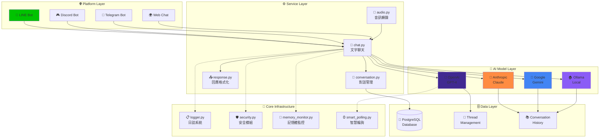

# 多平台聊天機器人 ChatGPT Line Bot

中文 | [English](README.en.md)

[](https://www.python.org/downloads/)
[](https://flask.palletsprojects.com/)
[](tests/)
[](tests/)
[](LICENSE)
[](https://cloud.google.com/run)
[](https://developers.line.biz/)
[](https://openai.com/)
[](https://anthropic.com/)
[](https://ai.google.dev/)
[](https://ollama.ai/)
[](#architecture)
[](README.md)

本專案是一個**多平台聊天機器人**，支援 LINE、Discord、Telegram 等多個平台，整合了多種 AI 模型提供商（OpenAI、Anthropic Claude、Google Gemini、Ollama）。機器人採用模組化架構設計，部署在 Google Cloud Run 上，並使用 Google Cloud SQL 進行對話歷史管理。

**🆕 v2.1 核心基礎設施整合升級**：高效能日誌系統與安全模組整合，優化效能並簡化維護。
**🎯 測試驗證完成**：73+ 單元測試全面通過，核心模組測試覆蓋率達 35-88%。

## 🚀 快速開始 (新手必讀)

### ⚡ 3 步驟快速部署

<details>
<summary><strong>📋 準備清單（點擊展開）</strong></summary>

**必需項目**：
- OpenAI API 金鑰：[註冊 OpenAI](https://platform.openai.com/)
- LINE Bot：[建立 LINE Channel](https://developers.line.biz/console/)
- Google Cloud 帳號：[開啟 Cloud Run](https://cloud.google.com/run)

</details>

```bash
# 1️⃣ 下載並設定
git clone https://github.com/tnsprout/ChatGPT-Line-Bot.git
cd ChatGPT-Line-Bot
pip install -r requirements.txt

# 2️⃣ 快速配置
cp config/config.yml.example config/config.yml
# 編輯 config.yml 填入 API 金鑰

# 3️⃣ 一鍵部署
./scripts/deploy/deploy-to-cloudrun.sh
```

🎉 **完成！** 您的多平台聊天機器人已就緒

### 💡 新手建議

#### 如果您是程式新手
- ✅ 先按照 [前置準備](#前置準備) 完成基本設定
- ✅ 使用 [本地開發配置](#本地開發配置) 進行測試
- ✅ 遇到問題先查看 [常見問題](#常見問題-faq)
- ✅ 加入我們的討論群組獲得協助

#### 如果您是經驗開發者
- ⚡ 直接使用 [Google Cloud Run 部署](#部署到-google-cloud-run)
- ⚡ 查看 [系統架構](#系統架構) 了解設計理念
- ⚡ 參考 [開發與測試](#開發與測試) 開始貢獻代碼

### 🎯 選擇您的路徑

| 使用情境 | 建議路徑 | 預估時間 |
|----------|----------|----------|
| 🔰 **新手試用** | 本地開發 → LINE Bot 測試 | 15 分鐘 |
| 🏢 **生產使用** | 完整配置 → Cloud Run 部署 | 45 分鐘 |
| 👨‍💻 **二次開發** | 系統架構 → 開發環境設定 | 30 分鐘 |
| 🚀 **快速體驗** | 使用現有部署腳本 | 5 分鐘 |

## 核心特色

🤖 **多 AI 模型支援**: 統一介面整合 OpenAI、Anthropic、Gemini、Ollama  
🌐 **多平台支援**: LINE、Discord、Telegram 等平台統一管理  
📚 **RAG 知識庫**: 所有模型支援文檔檢索與引用功能  
🔗 **統一引用處理**: 跨模型的一致引用格式化  
🎯 **平台抽象化**: Factory Pattern 支援快速擴展新平台  
🛡️ **企業級安全**: 輸入驗證、速率限制、錯誤處理  
📊 **監控與日志**: 完整的系統監控和性能指標  
🧠 **智慧資源管理**: 記憶體監控、智慧垃圾回收、輪詢策略最佳化  
⚡ **效能最佳化**: 預編譯正則表達式、異步處理、快取機制

## 目錄

- [前置準備](#前置準備)
- [AI 模型設定](#ai-模型設定)
  - [OpenAI Assistant API](#設定-openai-assistant-api)
  - [Anthropic Claude](#設定-anthropic-claude)
  - [Google Gemini](#設定-google-gemini)
  - [Ollama 本地模型](#設定-ollama-本地模型)
- [平台設定](#平台設定)
  - [LINE Bot](#設定-line-bot)
  - [Discord Bot](#設定-discord-bot)
  - [Telegram Bot](#設定-telegram-bot)
- [系統配置](#系統配置)
  - [資料庫設定](#設定-google-cloud-sql)
  - [多平台配置管理](#配置管理)
- [部署](#部署)
  - [本地開發](#本地開發配置)
  - [Google Cloud Run](#部署到-google-cloud-run)
- [開發與測試](#開發與測試)
- [常見問題與故障排除](#常見問題與故障排除)
  - [常見問題 (FAQ)](#常見問題-faq)
  - [故障排除步驟](#故障排除步驟)
  - [部署檢查清單](#部署檢查清單)
  - [性能優化建議](#性能優化建議)
- [監控與維護](#監控與維護)

## 前置準備

### 基本需求
- Python 3.8+ 開發環境
- Google Cloud Platform 帳號（用於部署和資料庫）

### AI 模型提供商（至少選擇一個）
- **OpenAI**: API 金鑰和 Assistant 設定
- **Anthropic Claude**: API 金鑰
- **Google Gemini**: API 金鑰
- **Ollama**: 本地模型運行環境

### 聊天平台（至少選擇一個）
- **LINE**: LINE Developers 帳號
- **Discord**: Discord Developer Portal 帳號
- **Telegram**: Telegram BotFather 設定

## AI 模型設定

<details>
<summary><strong>🤖 OpenAI GPT 設定</strong></summary>

### 取得 OpenAI 的 API Token

1. [OpenAI Platform](https://platform.openai.com/) 平台中註冊/登入帳號
2. 左上方有一個頭像，在那邊建立一個 Project
3. 進入 Project 後，於左邊尋找 Project → API Key
4. 點選右上角的 `+ Create` ，即可生成 OpenAI 的 API Token

</details>

<details>
<summary><strong>🎯 Anthropic Claude 設定</strong></summary>

1. **取得 Claude API Key**
   - 前往 [Anthropic Console](https://console.anthropic.com/)
   - 註冊並登入帳號
   - 在 API Keys 頁面建立新的 API Key

2. **選擇模型**
   - 建議使用 `claude-3-sonnet-20240229` 或 `claude-3-haiku-20240307`
   - 根據需求選擇平衡效能和成本的模型

</details>

<details>
<summary><strong>💎 Google Gemini 設定</strong></summary>

1. **取得 Gemini API Key**
   - 前往 [Google AI Studio](https://aistudio.google.com/)
   - 登入 Google 帳號
   - 在 API Keys 頁面建立新的 API Key

2. **選擇模型**
   - 建議使用 `gemini-1.5-pro-latest` 或 `gemini-1.5-flash-latest`
   - Gemini 支援長上下文和多模態功能

</details>

<details>
<summary><strong>🏠 Ollama 本地模型設定</strong></summary>

1. **安裝 Ollama**
   ```bash
   # macOS
   brew install ollama
   
   # Linux
   curl -fsSL https://ollama.ai/install.sh | sh
   
   # Windows - 下載安裝程式
   # https://ollama.ai/download
   ```

2. **下載模型**
   ```bash
   # 下載 Llama 3.1 8B 模型（推薦）
   ollama pull llama3.1:8b
   
   # 或下載其他模型
   ollama pull mistral:7b
   ollama pull codellama:13b
   ```

3. **啟動服務**
   ```bash
   ollama serve
   # 預設在 http://localhost:11434 運行
   ```

</details>

## 設定 OpenAI Assistant API

1. **建立Assistant**

   - 進入專案後，請在上方點選「Playground」，之後在介面左邊點選「Assistants」，進入OpenAI Assistant API的介面，接著建立一個Assistant。

2. **上傳您需要作為資料庫之檔案**

   - 請在 Assistant 介面上設定名稱與System instructions，作為機器人預設的system prompt。Model建議選取`gpt-4o`，Temperature建議設定為`0.01`。
   - 接著，在 Tools → File Search中，點選 `+ FIles` 上傳你要作為資料庫的檔案。

3. **在 Playground 測試可用性**

   - 前往 [OpenAI Playground](https://platform.openai.com/playground)
   - 測試您的 Assistant 是否能正常運作。

4. **記錄 assistant_id**

   - 在 Assistant 名字下方有一串文字，即為 `assistant_id`，請記錄下來，稍後會用到。

## 設定 Line Bot

1. **建立 Line Bot**

   - 登入 [Line Developers Console](https://developers.line.biz/console/)
   - 建立新的 Provider 和 Channel（Messaging API）

2. **取得 Channel 資訊**

   - 在 Channel 設定中，取得 `Channel Access Token` 和 `Channel Secret`
   - 在 `Basic Settings` 下方，有一個 `Channel Secret` →  按下 `Issue`，生成後即為 `channel_secret`。
   - 在 `Messaging API` 下方，有一個 `Channel access token` →  按下 `Issue`，生成後即為 `channel_access_token`。

3. **設定 Webhook URL**

   - 將 Webhook URL 設定為稍後部署的 Google Cloud Run 地址（可在部署完成後更新）
   - 啟用 Webhook，將「使用 Webhook」開關切換為開啟

## 平台設定

### 設定 Discord Bot

1. **建立 Discord 應用程式**
   - 前往 [Discord Developer Portal](https://discord.com/developers/applications)
   - 點選 "New Application" 建立新應用程式
   - 為應用程式命名

2. **建立 Bot**
   - 在左側選單選擇 "Bot"
   - 點選 "Add Bot" 建立機器人
   - 複製 Bot Token（注意保密）

3. **設定權限**
   - 在 "OAuth2" → "URL Generator" 中選擇適當的權限
   - 生成邀請連結並將 Bot 加入伺服器

### 設定 Telegram Bot

1. **與 BotFather 對話**
   - 在 Telegram 中搜尋 @BotFather
   - 發送 `/newbot` 指令建立新機器人
   - 按照指示設定機器人名稱和用戶名

2. **取得 Bot Token**
   - BotFather 會提供 Bot Token
   - 保存此 Token 用於配置

3. **設定 Webhook**
   - 部署完成後，使用以下 API 設定 Webhook：
   ```bash
   curl -X POST "https://api.telegram.org/bot<YOUR_BOT_TOKEN>/setWebhook" \
        -H "Content-Type: application/json" \
        -d '{"url": "https://your-app.run.app/webhook/telegram"}'
   ```

## 設定 Google Cloud SQL

1. **建立 Cloud SQL 個體**

   - 前往 [Cloud SQL Instances](https://console.cloud.google.com/sql/instances)
   - 點選 **建立執行個體**，選擇您需要的資料庫（例如 PostgreSQL）

2. **配置執行個體**

   - 設定執行個體名稱、密碼等資訊
   - 建立連線操作用之帳戶，並記錄使用者名稱與密碼
   - 建立資料庫
   - 使用 Alembic 建立資料庫架構：
    ```bash
    # 一鍵建立完整資料庫結構
    python scripts/setup_database.py setup
    
    # 或者手動使用 Alembic（進階用戶）
    alembic upgrade head
    ```

3. **取得連線資訊**

   - 在執行個體建立後，記下以下資訊：

     - 執行個體連線名稱（Instance Connection Name）
     - 主機（Host）
     - 埠號（Port）
     - 資料庫名稱（Database Name）
     - 使用者名稱（User）
     - 密碼（Password）

4. **取得 SSL 憑證**

   - 進入執行個體詳情頁面
   - 在 **連線** 標籤下，啟用 SSL 連線
   - 下載：

     - 服務器 CA 憑證（Server CA Certificate）
     - 用戶端憑證（Client Certificate）
     - 用戶端金鑰（Client Key）
   - 執行以下指令轉換以上憑證與金鑰

    ```bash
    openssl x509 -in client-cert.pem -out ssl-cert.crt # Server CA Certificate
    openssl x509 -in server-ca.pem -out ca-cert.crt # Client Certificate
    openssl rsa -in client-key.pem -out ssl-key.key # Client Key
    ```
   - 把 `ssl-cert.crt`、`ca-cert.crt`、`ssl-key.key` 這三個檔案複製到 `config/ssl/`下面

## 配置管理

本專案支援靈活的配置管理，適應不同的部署環境需求。

### 🎯 配置優先級

**應用程式配置優先級**（高優先級覆蓋低優先級）：
1. `config/config.yml` - 基本配置文件
2. **環境變數** - 最高優先級（適合生產環境）

**部署腳本配置優先級**：
1. `config/deploy/.env` - 部署配置文件  
2. **環境變數** - 最高優先級
3. 互動式輸入 - 當缺少配置時提示

### 📁 配置文件位置

```
config/
├── config.yml.example          # 應用程式配置範例
├── config.yml                  # 應用程式配置 (需自行建立)
└── deploy/
    ├── .env.example            # 部署配置範例  
    ├── .env                    # 部署配置 (需自行建立)
    ├── Dockerfile.cloudrun     # Cloud Run Dockerfile
    └── cloudrun-service.yaml   # Cloud Run 服務配置
```

### 💻 本地開發配置

請準備以下資訊：
- `channel_access_token` - Line Channel Access Token
- `channel_secret` - Line Channel Secret  
- `openai_api_key` - OpenAI API Key
- `assistant_id` - OpenAI Assistant ID
- 資料庫連線資訊

**方法 1: 使用配置文件（推薦）**

```bash
# 複製配置範例
cp config/config.yml.example config/config.yml

# 編輯配置文件
vim config/config.yml
```

```yaml
# 應用程式資訊
app:
  name: "Multi-Platform Chat Bot"
  version: "2.1.0"

# AI 模型設定（選擇一個作為主要提供商）
llm:
  provider: "openai"  # openai, anthropic, gemini, ollama

# AI 模型提供商設定
openai:
  api_key: YOUR_OPENAI_API_KEY
  assistant_id: YOUR_ASSISTANT_ID

anthropic:
  api_key: YOUR_ANTHROPIC_API_KEY
  model: "claude-3-sonnet-20240229"

gemini:
  api_key: YOUR_GEMINI_API_KEY
  model: "gemini-1.5-pro-latest"

ollama:
  base_url: "http://localhost:11434"
  model: "llama3.1:8b"

# 資料庫設定
db:
  host: YOUR_DB_HOST
  port: 5432
  database: YOUR_DB_NAME
  username: YOUR_DB_USER
  password: YOUR_DB_PASSWORD
  sslmode: verify-ca
  sslrootcert: config/ssl/ca-cert.crt
  sslcert: config/ssl/client.crt
  sslkey: config/ssl/client.key

# 平台設定
platforms:
  line:
    enabled: true
    channel_access_token: YOUR_LINE_CHANNEL_ACCESS_TOKEN
    channel_secret: YOUR_LINE_CHANNEL_SECRET
  
  discord:
    enabled: false  # 設為 true 以啟用
    bot_token: YOUR_DISCORD_BOT_TOKEN
  
  telegram:
    enabled: false  # 設為 true 以啟用
    bot_token: YOUR_TELEGRAM_BOT_TOKEN

# 文字處理設定
text_processing:
  preprocessors: []
  post_replacements: []

# 指令設定
commands:
  help: "提供系統說明和可用指令"
  reset: "重置對話歷史"
```

**方法 2: 使用環境變數**

```bash
# 基本設定
export LLM_PROVIDER="openai"  # 或 anthropic, gemini, ollama

# AI 模型 API 金鑰（根據所選提供商設定）
export OPENAI_API_KEY="sk-proj-xxxxxxxx"
export OPENAI_ASSISTANT_ID="asst_xxxxxxxx"
export ANTHROPIC_API_KEY="sk-ant-xxxxxxxx"
export GEMINI_API_KEY="AIza-xxxxxxxx"

# 平台設定（啟用所需平台）
export LINE_CHANNEL_ACCESS_TOKEN="your_line_token"
export LINE_CHANNEL_SECRET="your_line_secret"
export DISCORD_BOT_TOKEN="your_discord_token"      # 可選：啟用 Discord 平台
export TELEGRAM_BOT_TOKEN="your_telegram_token"    # 可選：啟用 Telegram 平台

# 資料庫設定
export DB_HOST="your_db_host"
export DB_USER="your_db_user"
export DB_PASSWORD="your_db_password"
export DB_NAME="your_db_name"

# 運行應用（使用統一入口點）
python main.py
```

### ☁️ 生產環境配置

生產環境使用 Google Secret Manager 管理敏感資訊，通過環境變數注入到容器中。

**支援的環境變數對照**：

| 配置項目 | config.yml 路徑 | 環境變數 |
|----------|----------------|----------|
| Line Access Token | `platforms.line.channel_access_token` | `LINE_CHANNEL_ACCESS_TOKEN` |
| Line Secret | `platforms.line.channel_secret` | `LINE_CHANNEL_SECRET` |
| OpenAI API Key | `openai.api_key` | `OPENAI_API_KEY` |
| OpenAI Assistant ID | `openai.assistant_id` | `OPENAI_ASSISTANT_ID` |
| 資料庫主機 | `db.host` | `DB_HOST` |
| 資料庫用戶 | `db.user` | `DB_USER` |
| 資料庫密碼 | `db.password` | `DB_PASSWORD` |
| 資料庫名稱 | `db.db_name` | `DB_NAME` |
| 認證方式 | `auth.method` | `TEST_AUTH_METHOD` |
| 日誌級別 | `log_level` | `LOG_LEVEL` |

### 🚀 **統一啟動方式 (v2.0)**

新版本提供統一的入口點，自動根據環境切換運行模式：

#### 開發環境
```bash
# 自動檢測為開發環境，使用 Flask 開發伺服器
python main.py

# 或明確指定開發環境
FLASK_ENV=development python main.py
```

#### 生產環境
```bash
# 自動啟動 Gunicorn 生產伺服器
FLASK_ENV=production python main.py

# 或使用傳統方式
gunicorn -c gunicorn.conf.py main:application
```

#### 向後兼容
```bash
# 舊版兼容部署方式（已整合到 main.py）
gunicorn -c gunicorn.conf.py main:application
```

### 🔍 配置驗證

```bash
# 檢查應用程式配置
python src/core/config.py

# 檢查健康狀態
curl http://localhost:8080/health

# 檢查部署配置  
./scripts/deploy/deploy-to-cloudrun.sh --dry-run
```

詳細的配置說明請參考：
- [配置管理指南](docs/CONFIGURATION.md)
- [部署指南](DEPLOYMENT_GUIDE.md)

## 部署到 Google Cloud Run

### 🚀 快速部署（推薦）

使用我們提供的自動化部署腳本：

```bash
# 1. 設定部署配置
cp config/deploy/.env.example config/deploy/.env
# 編輯 config/deploy/.env 檔案，填入你的專案設定

# 2. 執行自動部署腳本
./scripts/deploy/deploy-to-cloudrun.sh

# 3. 檢查配置（可選）
./scripts/deploy/deploy-to-cloudrun.sh --dry-run
```

### 📖 詳細部署指南

如需完整的部署流程、監控設定、負載平衡器配置等，請參考：
- [完整部署指南](docs/DEPLOYMENT.md)  
- [配置管理指南](docs/CONFIGURATION.md)
- [運行指南](docs/RUNNING.md)

### 🔧 手動部署（進階用戶）

如果你想要手動控制每個步驟：

1. **設定Google Cloud Console**

   ```bash
   gcloud auth login
   gcloud config set project {your-project-id}
   ```

2. **建立容器映像**

   ```bash
   gcloud builds submit --tag gcr.io/{your-project-id}/{your-image-name} -f config/deploy/Dockerfile.cloudrun .
   ```

3. **部署到 Cloud Run**

   ```bash
   gcloud run services replace config/deploy/cloudrun-service.yaml --region {your-region}
   ```

   - 請將以上指令中的佔位符替換為您的實際資訊。

4. **測試部署結果**

   - 部署後，會回傳一個Service URL，如 https://chatgpt-line-bot-****.run.app ，請記錄下來。

5. **設定 Webhook URL**

   - 進入Line Bot設定介面，將 Webhook URL 設定 Service URL 地址。
   - 啟用 Webhook，將「使用 Webhook」開關切換為開啟。
   - 點選 Verify，看是否回傳成功。

## 測試程式運作

### 🔐 Web 測試介面 (v2.0)

1. **訪問登入頁面**
   - 前往 `https://{your-cloud-run-url}/login`
   - 輸入在 `config.yml` 中設定的測試密碼
   - 登入成功後會自動跳轉到聊天介面

2. **使用聊天介面**
   - 登入後訪問 `https://{your-cloud-run-url}/chat`
   - 在聊天介面中直接測試機器人功能
   - 支援文字訊息和完整的對話歷史
   - 點選「登出」按鈕可安全登出

3. **API 端點測試**
   ```bash
   # 健康檢查
   curl https://{your-cloud-run-url}/health
   
   # 應用資訊
   curl https://{your-cloud-run-url}/
   ```

### 📱 透過 LINE 測試

4. **LINE Bot 功能測試**
   - 向您的 LINE Bot 發送訊息，測試完整功能
   - 支援文字和語音訊息
   - 測試對話歷史和多輪對話

### 🔍 故障排除

5. **檢查系統日誌**
   - 如果出現問題，使用 `gcloud` 或 Google Cloud Console 來檢查日誌
   ```bash
   # 查看即時日誌
   gcloud logs tail --project={your-project-id}
   ```

### ⚙️ 測試密碼配置

**生產環境**：
```bash
# 設定環境變數（推薦）
export TEST_PASSWORD="your_secure_password_here"
```

**開發環境**：
```yaml
# 在 config/config.yml 中設定
auth:
  method: "simple_password"
  password: "your_test_password"
```

## 開發與測試

### 本地開發設定

1. **安裝依賴套件**
   ```bash
   pip install -r requirements.txt
   ```

2. **設定本地環境變數**
   ```bash
   # 複製環境變數模板
   cp .env.local.example .env.local
   
   # 編輯 .env.local 填入您的配置
   vim .env.local
   ```

3. **運行開發服務器**
   
   **🔧 開發環境（推薦）：**
   ```bash
   # 使用開發腳本啟動
   ./scripts/dev.sh
   ```
   
   **🧪 本地生產測試：**
   ```bash
   # 測試生產配置
   ./scripts/test-prod.sh
   ```
   
   **⚡ 直接運行：**
   ```bash
   # 開發模式（會顯示警告，這是正常現象）
   python main.py
   
   # 生產模式（自動啟動 Gunicorn）
   FLASK_ENV=production python main.py
   ```

## 系統架構

### 🎯 **核心模組整合 (v2.1)**

為提升效能與維護性，核心基礎設施已完成整合升級：

#### 整合模組說明
- **src/core/logger.py**: 整合高效能日誌系統（移除 optimized_logger.py）
  - 預編譯正則表達式敏感資料過濾
  - 異步日誌處理避免 I/O 阻塞
  - 結構化日誌格式與彩色控制台輸出
  - 效能監控與統計功能

- **src/core/security.py**: 整合安全模組（移除 optimized_security.py）
  - O(1) 複雜度速率限制器
  - 預編譯正則表達式輸入驗證
  - 安全配置管理與中間件
  - 快取機制提升清理效能

#### 架構優化成果
- ✅ **檔案數量減少**: 移除重複的 optimized_* 檔案
- ✅ **效能提升**: 預編譯正則表達式、異步處理、快取機制
- ✅ **維護簡化**: 統一模組介面，降低複雜度
- ✅ **向後兼容**: 保持現有 API 介面不變

### 📐 系統架構圖



### 檔案結構

```
src/
├── services/           # 服務層
│   ├── chat.py        # 文字聊天服務
│   ├── audio.py       # 音訊轉錄服務
│   ├── conversation.py # 對話管理
│   └── response.py    # 回應格式化
├── database/          # 資料庫層
│   ├── connection.py  # 資料庫連接
│   ├── models.py      # 資料模型
│   ├── operations.py  # 資料庫操作工具
│   └── init_db.py     # 資料庫初始化
├── core/              # 核心基礎設施 (v2.1 整合版)
│   ├── config.py      # 配置管理器
│   ├── logger.py      # 整合高效能日誌系統
│   ├── security.py    # 整合安全模組
│   ├── error_handler.py # 錯誤處理
│   ├── auth.py        # 認證系統
│   └── memory.py      # 記憶體管理
├── platforms/         # 平台支援
│   ├── base.py        # 平台抽象介面
│   ├── factory.py     # 平台工廠
│   └── line_handler.py # LINE 平台處理器
├── models/           # AI 模型整合
│   ├── base.py       # 模型抽象介面
│   ├── factory.py    # 模型工廠
│   ├── openai_model.py # OpenAI 整合
│   ├── anthropic_model.py # Anthropic 整合
│   ├── gemini_model.py # Gemini 整合
│   └── ollama_model.py # Ollama 整合
├── templates/         # 網頁模板
│   ├── chat.html
│   └── login.html
└── utils/            # 工具模組
    ├── main.py       # 文字處理工具
    └── retry.py      # 重試機制

scripts/
└── setup_database.py # 一鍵資料庫設置

alembic/               # 資料庫遷移管理
├── versions/
│   ├── 000_initial_schema.py      # 完整初始結構
│   └── 001_add_platform_support.py # 多平台支援
└── alembic.ini        # Alembic 配置
```

### 統一引用處理

所有 AI 模型的文檔引用都通過 `ResponseFormatter` 統一處理：

**訊息處理流程**：

**文字訊息流程**：
1. **平台輸入** → ChatService → AI 模型 → ResponseFormatter → **平台輸出**

**音訊訊息流程**：
1. **平台輸入** → AudioService（轉錄）→ app.py（協調）→ ChatService → AI 模型 → ResponseFormatter → **平台輸出**

**引用處理流程**：
1. **AI 模型回應** → 包含 RAGResponse (answer + sources)
2. **ResponseFormatter** → 統一格式化 sources 為可讀引用
3. **最終回應** → 一致的引用格式 `[1]: 文檔名稱`

**支援的引用格式**：
- **OpenAI**: Assistant API 文件引用 `[i]` → `[i]: filename`
- **Anthropic**: Claude Files API 引用 `[filename]` → `[i]: filename`  
- **Gemini**: Semantic Retrieval 結果 → `[i]: filename (相關性: 95%)`
- **Ollama**: 向量搜尋結果 → `[i]: filename (相似度: 0.89)`

### 設計模式

- **Factory Pattern**: AI 模型和平台的動態創建
- **Strategy Pattern**: 不同 AI 模型的統一介面
- **Registry Pattern**: 平台和模型的註冊管理
- **Adapter Pattern**: 平台特定功能的適配

### 資料庫架構

系統使用 PostgreSQL 資料庫，支援多平台對話管理。資料庫結構包含：

- **用戶 Thread 管理**: 支援 OpenAI Assistant API 的多平台線程管理
- **對話歷史**: 儲存非 OpenAI 模型的對話記錄
- **多平台支援**: 所有表格都支援 LINE、Discord、Telegram 等平台

### 資料庫初始化

```bash
# 一鍵建立完整資料庫結構
python scripts/setup_database.py setup

# 檢查資料庫狀態
python scripts/setup_database.py status

# 執行健康檢查
python scripts/setup_database.py health

# 使用 Alembic 直接管理（進階用戶）
alembic upgrade head  # 執行資料庫遷移
alembic current       # 查看目前版本
```

### 安裝測試依賴

```bash
pip install -r requirements-test.txt
```

### 執行測試

本專案使用 pytest 作為測試框架，包含單元測試、整合測試和 API 測試。

**執行所有測試：**
```bash
pytest
```

**執行特定測試類型：**
```bash
# 單元測試
pytest tests/unit/

# 整合測試
pytest tests/integration/

# API 測試
pytest tests/api/

# 外部服務模擬測試
pytest tests/mocks/
```

**測試覆蓋率報告：**
```bash
pytest --cov=src --cov-report=html
```

**詳細測試輸出：**
```bash
pytest -v
```

**指定測試檔案：**
```bash
pytest tests/unit/test_models.py
pytest tests/integration/test_chat_flow.py
```

### 程式碼品質檢查

```bash
# 檢查程式碼風格
flake8 src/ tests/

# 型別檢查
mypy src/
```

### 測試故障排除

如果遇到導入錯誤或快取問題：
```bash
# 清理 Python 快取檔案
find . -name "*.pyc" -delete
find . -name "__pycache__" -type d -exec rm -rf {} + 2>/dev/null || true
rm -rf .pytest_cache

# 重新運行測試
pytest
```

**CI/CD 整合測試：**
```bash
# 運行完整的 CI/CD 模擬測試流程
./scripts/ci-test.sh
```

### 測試架構 (Updated 2025)

本專案採用分層測試架構，涵蓋所有關鍵功能：

- **單元測試** (`tests/unit/`): 測試個別模組和核心功能
  - AI 模型測試 (OpenAI、Anthropic、Gemini、Ollama)
  - 平台處理器測試 (LINE、Discord、Telegram)
  - 核心服務測試 (聊天、對話管理、回應格式化)
  - 資料庫相關測試 (ORM、連接、操作)
  - 認證和配置管理測試
  - **核心基礎設施測試**：記憶體監控、安全模組、智慧輪詢等
- **整合測試** (`tests/integration/`): 測試跨模組的端到端功能
  - 資料庫與 ORM 整合測試
  - 多平台工作流程測試
- **API 測試** (`tests/api/`): 測試 Flask 端點和 Web 介面
  - 健康檢查和系統狀態端點
  - 多平台 Webhook 端點測試
- **模擬測試** (`tests/mocks/`): 測試外部服務的模擬和整合
  - AI 模型 API 模擬 (OpenAI、Anthropic、Gemini、Ollama)
  - 平台 API 模擬 (LINE Bot、Discord、Telegram)
  - 資料庫操作模擬
- **主應用程式測試** (`test_main.py`): 測試應用程式入口點和 WSGI 兼容性

#### 測試品質保證特色
- ✅ **架構一致性**: 測試反映實際系統架構和責任分工
- ✅ **平台感知**: 多平台統一介面的完整測試覆蓋
- ✅ **引用處理**: AI 模型引用架構分離的正確測試
- ✅ **錯誤處理**: 雙層錯誤訊息和異常處理測試
- ✅ **配置管理**: 環境變數覆蓋和設定相容性測試
- ✅ **穩健性提升**: 解決模組重載和時間模擬等測試穩定性問題

#### 重點模組測試覆蓋
- **security.py**: O(1) 速率限制器、預編譯正則表達式驗證
- **smart_polling.py**: 智慧輪詢策略和上下文管理
- **memory_monitor.py**: 記憶體監控和垃圾回收
- **app.py**: 主應用程式核心功能測試

#### 最新測試改進 (2025)
- ✅ **解決模組重載問題**: 修復 `importlib.reload()` 導致的 `isinstance` 檢查失敗
- ✅ **時間模擬增強**: 改進時間模擬機制，避免 `StopIteration` 異常造成的測試失敗
- ✅ **速率限制器測試**: 繞過全局 mock 干擾，確保真實 RateLimiter 統計功能測試
- ✅ **測試隔離**: 分離測試錯誤，確保測試間不會相互影響
- ✅ **全面覆蓋**: 新增 73+ 單元測試，持續提升覆蓋率

### 配置檔案

測試配置檔案位於 `pytest.ini`，包含以下設定：
- 測試路徑
- 覆蓋率設定
- 測試標記
- 輸出格式

## 常見問題與故障排除

### 🔧 常見問題 (FAQ)

#### Q1: 部署後 LINE Bot 沒有回應？
**解決方案**：
```bash
# 1. 檢查 Webhook URL 設定
curl -X POST https://your-app.run.app/webhooks/line

# 2. 檢查環境變數
gcloud run services describe YOUR_SERVICE --region=YOUR_REGION

# 3. 查看即時日誌
gcloud logs tail --project=YOUR_PROJECT_ID
```

#### Q2: 資料庫連接失敗？
**檢查清單**：
- ✅ SSL 憑證檔案是否正確放置在 `config/ssl/`
- ✅ 資料庫帳號密碼是否正確
- ✅ 防火牆規則是否允許連接
- ✅ 環境變數 DB_HOST, DB_USER, DB_PASSWORD 是否設定

#### Q3: AI 模型回應錯誤？
**診斷步驟**：
```bash
# 檢查 API 金鑰是否有效
curl -H "Authorization: Bearer $OPENAI_API_KEY" https://api.openai.com/v1/models

# 檢查配置檔案
python -c "from src.core.config import ConfigManager; print(ConfigManager().get_config())"
```

#### Q4: 記憶體使用過高？
**監控與優化**：
```bash
# 檢查記憶體使用
curl https://your-app.run.app/health

# 手動觸發垃圾回收（開發用）
curl -X POST https://your-app.run.app/debug/gc
```


#### Q5: 核心模組效能問題？
**效能最佳化檢查**：
```bash
# 檢查速率限制器統計
curl https://your-app.run.app/debug/security

# 檢查記憶體監控狀態
curl https://your-app.run.app/debug/memory

# 檢查日誌效能統計
curl https://your-app.run.app/debug/logs
```

### 🚨 故障排除步驟

#### 1. 快速診斷
```bash
# 檢查系統整體健康狀態
curl https://your-app.run.app/health

# 檢查應用程式資訊
curl https://your-app.run.app/

# 檢查平台狀態
curl https://your-app.run.app/metrics
```

#### 2. 日誌分析
```bash
# 查看最新錯誤日誌
gcloud logs read --project=YOUR_PROJECT_ID --filter="severity>=ERROR" --limit=50

# 查看特定時間範圍的日誌
gcloud logs read --project=YOUR_PROJECT_ID --filter="timestamp>='2025-01-01T00:00:00Z'"

# 即時監控日誌
gcloud logs tail --project=YOUR_PROJECT_ID
```

#### 3. 配置驗證
```bash
# 驗證配置檔案語法
python -c "import yaml; yaml.safe_load(open('config/config.yml'))"

# 檢查環境變數
env | grep -E "(OPENAI|LINE|DB_|FLASK_)"

# 測試資料庫連接
python scripts/setup_database.py health
```

### 📋 部署檢查清單

#### 部署前確認
- [ ] 所有 API 金鑰已設定並有效
- [ ] 資料庫已建立且可連接
- [ ] SSL 憑證檔案已正確放置
- [ ] 配置檔案格式正確無誤
- [ ] 本地測試通過

#### 部署後驗證
- [ ] 健康檢查端點返回正常：`/health`
- [ ] Webhook URL 設定正確
- [ ] LINE Bot 可以接收和回應訊息
- [ ] 資料庫連接正常
- [ ] 日誌無明顯錯誤

### ⚡ 性能優化建議

#### 1. 記憶體優化
```yaml
# 在 Cloud Run 設定中調整
resources:
  limits:
    memory: "2Gi"
    cpu: "1000m"
  requests:
    memory: "1Gi"
    cpu: "500m"
```

#### 2. 速率限制調整
```bash
# 根據使用量調整環境變數
export GENERAL_RATE_LIMIT=120
export WEBHOOK_RATE_LIMIT=300
export MAX_MESSAGE_LENGTH=5000
```

#### 3. 資料庫連接池
```yaml
# 在 config.yml 中設定
db:
  pool_size: 5
  pool_timeout: 30
  pool_recycle: 3600
```

### 🔒 安全最佳實踐

#### 生產環境安全
- ✅ 使用 Google Secret Manager 管理敏感資訊
- ✅ 定期輪換 API 金鑰
- ✅ 啟用 Cloud Run 的身分驗證
- ✅ 設定適當的 IAM 角色和權限

#### 開發環境安全
- ✅ 不要在 Git 中提交敏感資訊
- ✅ 使用 `.env.local` 管理開發環境配置
- ✅ 定期檢查依賴套件的安全漏洞
- ✅ 啟用程式碼掃描和安全檢查

## 監控與維護

### 📊 系統監控

#### 內建監控端點
```bash
# 應用程式健康狀態
curl https://your-app.run.app/health

# 系統指標
curl https://your-app.run.app/metrics

# 記憶體監控
curl https://your-app.run.app/debug/memory
```

#### Google Cloud 監控
```bash
# 設定監控警報
gcloud alpha monitoring policies create --policy-from-file=monitoring-policy.yaml

# 查看 Cloud Run 指標
gcloud run services describe YOUR_SERVICE --region=YOUR_REGION
```

### 🔄 定期維護

#### 每週檢查
- 檢查系統日誌，查看異常模式
- 驗證資料庫備份是否正常
- 檢查 API 使用量和費用
- 更新相依套件（測試環境先行）

#### 每月檢查
- 檢討系統效能指標
- 分析使用者行為模式
- 規劃容量擴展需求
- 檢查安全性設定

## 注意事項

### 🚫 重要限制
- **LINE Bot 訊息限制**: 單則訊息最大 5000 字元
- **OpenAI API 限制**: 依據您的訂閱方案而定
- **Cloud Run 限制**: 單一請求最長 60 分鐘逾時
- **資料庫連接數**: 注意 Cloud SQL 的連接數限制

### ⚠️ 安全注意事項
- 確保所有敏感資訊只放在 `config/ssl/` 和環境變數中
- 定期檢查 Google Cloud IAM 權限設定
- 使用 Google Secret Manager 管理生產環境密碼
- 遵循最小權限原則設定服務帳號

### 💡 開發建議
- 開發新功能前先寫測試用例
- 使用分支策略進行版本控制
- 定期執行完整測試套件
- 保持程式碼格式和文件的一致性

## 捐款支持

本專案由台南新芽進行，若您希望能支持本專案，請[捐款贊助台南新芽](https://bit.ly/3RBvPyZ)。

## 特別感謝

本專案 Fork 自 [ExplainThis 的 ChatGPT-Line-Bot](https://github.com/TheExplainthis/ChatGPT-Line-Bot) 。特此致謝。

## 授權

[MIT](LICENSE)
